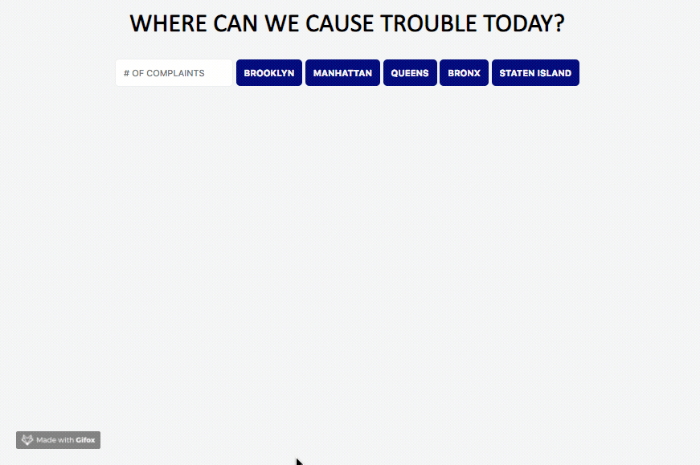

## Dougie the Donut & Pizza Rat 🍩 🐀 (Complaint App)

### Instructions
- Create a directory named complaints_app
- Inside that directory, create app.js, index.html, and styles.css files
- Link them up, as well as the jQuery CDN library, and make sure all things are connected correctly!

### The App

Overall, what Dougie and Pizza Rat want for this app is for it to search through the 311 call data (Links to an external site.) provided by the NYC Open Data API (Links to an external site.), and display all the complaints made to the NYPD, filtered by borough. They also want to see how the police responded to the complaint, since that's what they'll use to determine whether or not they can cause the same trouble without consequences!

### The Data

For this particular API, NYC Open Data, the data sent after making an AJAX call is formatted as JSON.

### Page Requirements
For this lab in particular, here are some important pages you may need to look through to do this lab:
- The 311 Service Requests API Documentation (Links to an external site.)
- This page in particular shows an example AJAX call using jQuery, however you'll notice instead of a .then promise, it uses .done -- convert it so that it uses the AJAX call format you learned in class today
- The 311 Service Requests Data Info Page (Links to an external site.)
- Info on how to filter the API Data Being Returned (Links to an external site.)
- Info on how you can Customize the API Queries More Precisely (Links to an external site.)

### Minimum Viable Product (MVP)

Below is a more detailed list of what functionalities Dougie and Pizza Rat want for their app.

- Users should be able to see five buttons for the five boroughs (manhattan, brooklyn, queens, staten island, bronx) of New York City when they load the page
- Users should also be able to see an input box where they can put in a number of how many complaints they want to see
- When the user clicks on one of the five buttons, a list of complaints should be displayed on the page, according to the number they input AND the borough they clicked on
- If the user doesn't input any number, make the default be 10
- When the list of complaints is shown, each complaint should also have a button on it that reads something along the lines of "toggle police response"
- When the user clicks on on the "toggle police response" button, it should then toggle how the police responded to that particular complaint
- Make sure it only toggles the response for that one complaint, not the entire list!

Example of a working app

