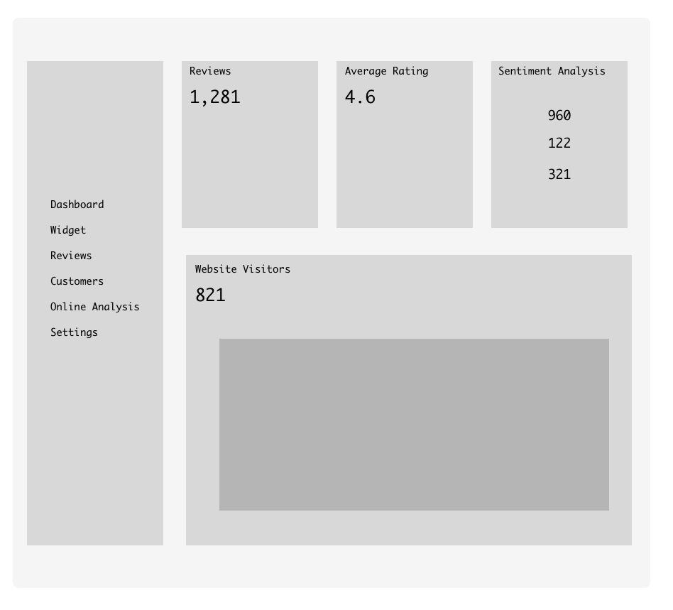

# React Static Components

## Instructions
<strong>Dashboard Wireframe: </strong>

- Try to recreate this wireframe with React. Be sure to create a few functional components (e.g. app, sidebar, etc).
- Reuse components where necessary (For example: Reviews, AverageRating, and Sentiment Analysis could be one component accepting different props).    
- Reviews, Rating, SentimentalAnalysis should be three different functional components saved in the same Box.js file. 
- Make use of props to populate the number values for each component.
