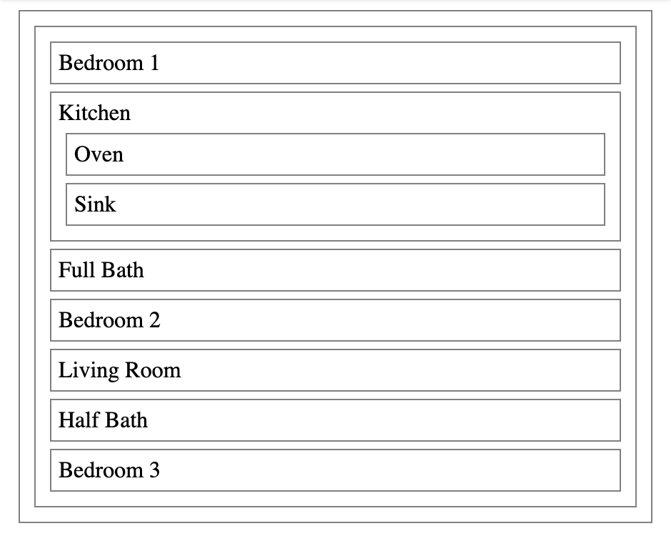

# FloorPlan / Functional Components

## Requirements
  1. Define each component in its own file. The naming convention to use for a component's file is UpperCamelCase also known as Pascal Case, for example, a <CodeSandbox> component's file would be named CodeSandbox.js (CodeSandbox.jsx also works).
  2. Export each component from its module.
  3. Define the following components as functions and code them such that they fulfill their responsibilities
  - FloorPlan
  - Kitchen
  - LivingRoom
  - Bedroom
  - Bath
  - Oven
  - Sink
  - LivingRoom
  4. Add the following CSS inside of styles.css to style each component's wrapping 
 to make it easier to visualize the components:
  
<!-- --->
        div {
          border: 1px solid grey;
          margin: 5px;
          padding: 5px;
        }
  
  <strong>Output:</strong>
   
  
