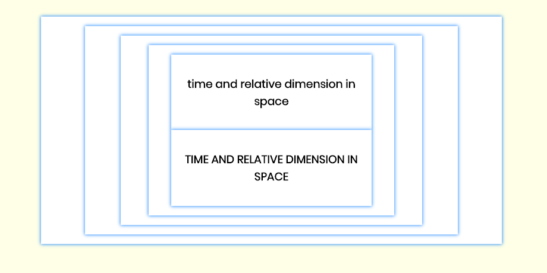

# T.A.R.D.I.S.
Doctor Who's Police Box is a T.A.R.D.I.S (Time and Relative Dimension In Space), a fantastical space ship that can fly through time and space and other mind-bending-ly impossible situations. It can go anywhere.

## Instructions

Today, you're going to help the T.A.R.D.I.S. navigate through a React App in the form of an object

tardis = {
  name: 'Time and Relative Dimension in Space',
  caps: false,
}

Output :
 

